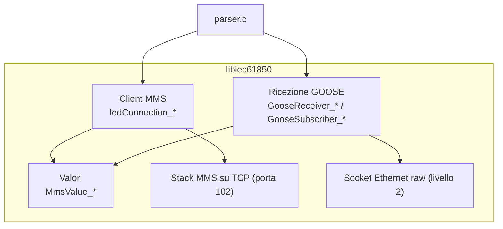
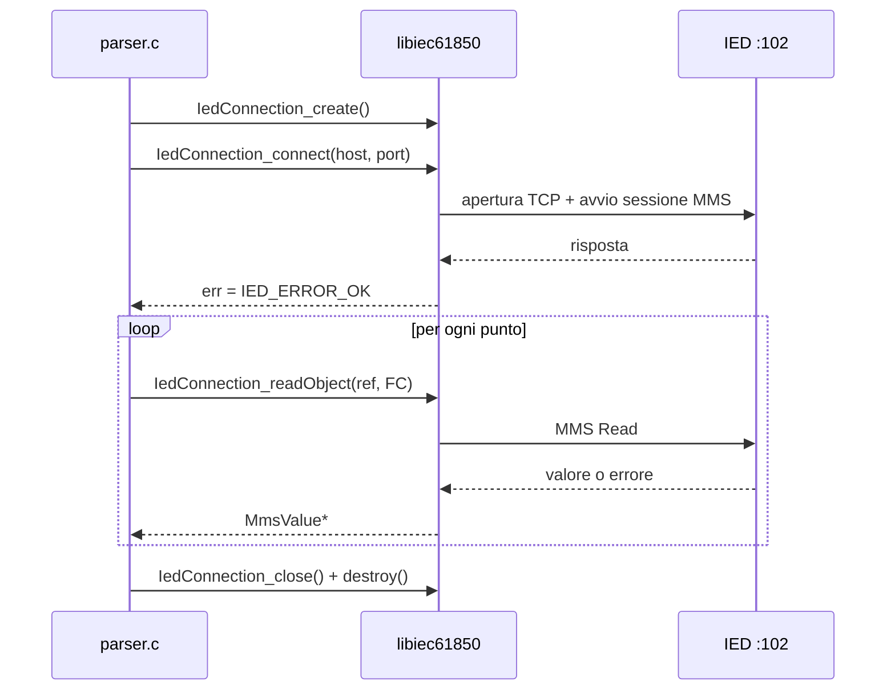
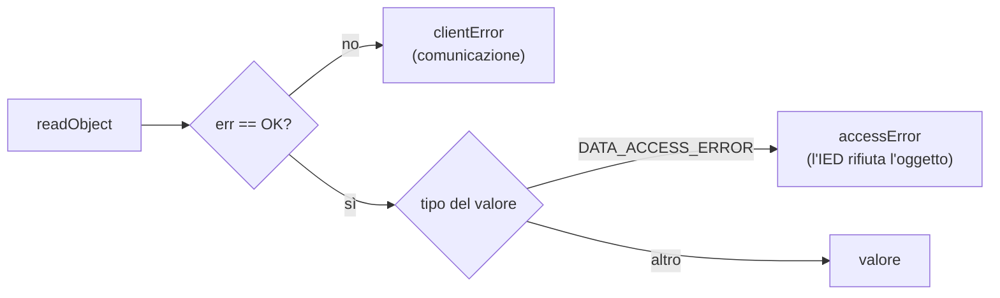

# libiec61850 nel banco di prova BU9020

Questo documento spiega **come funziona libiec61850** e **come la usa il nostro
parser** (`source/parser/parser.c`). Per ogni argomento c'è, a sinistra, cosa
offre la libreria e, a destra, il codice corrispondente del parser (che
in tutto è di circa 150 righe).

| | |
|---|---|
| Versione | **1.6.2**, ramo `v1.6_develop` (commit `bc495e97`) |
| Sorgenti | `~/libiec61850` |
| Header e libreria | `~/libiec61850/.install/{include,lib}`, collegati al progetto da `lib/libiec61850` |
| Licenza | **GPLv3** (esiste una licenza commerciale di MZ Automation) |

> **Licenza.** Per la tesi e per un banco di prova interno la GPLv3 va bene.
> Se il software diventasse un prodotto distribuito da COL Group, servirebbe
> la licenza commerciale. Da segnalare al tutor.

---

## 0. Glossario minimo

| Termine | Significato | Esempio (IED di test) |
|---|---|---|
| **IED** | il dispositivo (relè, controllore di stallo) | `XSCT1M01SMNPBMUC` |
| **LD** – Logical Device | gruppo di funzioni dell'IED | `XSCT1M01SMNPBMUCM1` |
| **LN** – Logical Node | una funzione (misure, interruttore, sincronismo…) | `LBMULPHD1` |
| **DO** – Data Object | un dato della funzione | `PhyHealth` |
| **DA** – Data Attribute | un campo del dato | `stVal`, `q`, `t` |
| **FC** – Functional Constraint | categoria dell'attributo | `ST` stato, `MX` misura, `DC` descrizione |
| **MMS** | protocollo client/server su TCP (porta 102) per leggere e scrivere i dati | |
| **GOOSE** | messaggi multicast Ethernet che l'IED pubblica a ogni evento | |
| **GoCB** | il blocco che controlla un flusso GOOSE | `LLN0$GO$GseBCU_Op_gocb` |
| **RCB** | Report Control Block: l'IED invia i dati al client quando cambiano | `LLN0.op_urcb01` |

---

## 1. Cosa fa la libreria e quali parti usiamo

libiec61850 è scritta in C e implementa i protocolli di IEC 61850. Ha una parte
*server* (per costruire un IED) e una parte *client* (per interrogarlo).

| Parte della libreria | Header | La usiamo? |
|---|---|---|
| Client MMS | `iec61850_client.h` | **sì**: letture dei punti e degli RCB |
| Ricezione GOOSE | `goose_receiver.h`, `goose_subscriber.h` | **sì**: i GOOSE del GoCB dell'IED |
| Valori MMS | `mms_value.h` (incluso dai precedenti) | **sì**: conversione in JSON (con cJSON) |
| Server IEC 61850 | `iec61850_server.h` | no (solo l'esempio `server_example_basic_io` per i test) |
| Pubblicazione GOOSE, Sampled Values, R-GOOSE | `goose_publisher.h`, `sv_*.h` | no |



Due conseguenze pratiche:

- **MMS** usa TCP/IP: bastano IP e porta dell'IED (`host`, `port` in configurazione).
- **GOOSE** non usa IP: è un frame Ethernet (EtherType `0x88B8`) inviato a un
  MAC multicast. Per riceverlo la libreria apre un *socket raw*
  sull'interfaccia di rete: per questo il parser va eseguito con **`sudo`**
  (o con `setcap cap_net_raw+ep bin/parser`).

---

## 2. I nomi dei dati

Lo stesso dato ha nomi diversi a seconda di dove compare. È la causa più
frequente di errori.

| Dove | Forma | Esempio |
|---|---|---|
| **Configurazione del parser** e API client | `LD/LN.DO.DA` + FC a parte | `XSCT1M01SMNPBMUCM1/LBMULPHD1.PhyHealth.stVal`, FC `ST` |
| **Sulla rete** (variabile MMS) | dominio `LD`, nome `LN$FC$DO$DA` | `LBMULPHD1$ST$PhyHealth$stVal` |
| **Frame GOOSE** | `LD/LN$GO$nome` | `XSCT1M01SMNPBMUCM1/LLN0$GO$GseBCU_Op_gocb` |

La libreria converte da sola la prima forma nella seconda: il nome del LD
diventa il *dominio* MMS, i `.` diventano `$` e l'FC viene inserito dopo il LN.
Il nome della variabile MMS non può superare **64 caratteri** (il riferimento
completo 129): oltre, la lettura fallisce con errore 12.

<table>
<tr><th>Libreria</th><th>parser.c</th></tr>
<tr><td>

L'FC è un tipo enumerato (`IEC61850_FC_ST`, `IEC61850_FC_MX`…).
`FunctionalConstraint_fromString("ST")` lo ricava dalla stringa, ma guarda
**solo i primi due caratteri**: `"STX"` verrebbe preso per `ST`.

</td><td>

Il parser passa l'FC del config così com'è:

```c
IedConnection_readObject(con, &err, p->string,
        FunctionalConstraint_fromString(p->valuestring));
```

Un FC sbagliato produce un errore di lettura
nell'output; il config va quindi scritto con FC di
due lettere corretti.

</td></tr>
</table>

---

## 3. Connessione MMS

La connessione si gestisce con un oggetto `IedConnection`, in quattro passi:
**crea → connetti → usa → chiudi e distruggi**.



<table>
<tr><th>Libreria</th><th>parser.c</th></tr>
<tr><td>

`IedConnection_connect()` è **bloccante**: ritorna quando la sessione è aperta
o è fallita. L'esito è in `err`.

Timeout di default (non li cambiamo):
connessione **10 s**, ogni richiesta **5 s**
(`IedConnection_setConnectTimeout` / `setRequestTimeout` per modificarli).

Internamente la libreria avvia un **thread** che riceve le risposte.

</td><td>

`main()`:

```c
IedConnection con = IedConnection_create();
IedConnection_connect(con, &err, host, port->valueint);
if (err != IED_ERROR_OK) {
    /* es. err=5: IED spento o irraggiungibile */
    fprintf(stderr, "connessione MMS ... fallita ...");
    return 1;
}
```

Subito dopo le letture:

```c
IedConnection_close(con);
IedConnection_destroy(con);
```

</td></tr>
</table>

---

## 4. Lettura di un dato

<table>
<tr><th>Libreria</th><th>parser.c</th></tr>
<tr><td>

`IedConnection_readObject(con, &err, ref, fc)` legge un attributo (o un DO
intero) e restituisce un **`MmsValue*`**.

Regole:

- se la richiesta fallisce, `err` ≠ `IED_ERROR_OK`;
- il valore restituito **va liberato** con `MmsValue_delete()`;
- leggendo un DO intero (es. `GGIO1.AnIn1`, FC `MX`) si ottiene una
  struttura con valore, qualità e timestamp in una sola richiesta.

</td><td>

`main()`, un'iterazione per punto del config
(riferimento → FC):

```c
MmsValue* v = IedConnection_readObject(con, &err,
        p->string,
        FunctionalConstraint_fromString(p->valuestring));
if (v) {
    cJSON_AddItemToObject(mms, p->string, mms_json(v));
    MmsValue_delete(v);
} else {
    cJSON_AddNumberToObject(
        cJSON_AddObjectToObject(mms, p->string),
        "clientError", err);
}
```

</td></tr>
</table>

---

## 5. I valori: `MmsValue`

`MmsValue` è un contenitore generico: prima si chiede il **tipo**, poi si
legge il valore con la funzione giusta. Il parser lo fa in un'unica funzione,
`mms_json()`, usata sia per MMS sia per GOOSE: restituisce il valore come nodo
cJSON.

| Tipo MMS | Dati IEC 61850 tipici | Funzione della libreria | Output del parser |
|---|---|---|---|
| `MMS_BOOLEAN` | SPS.stVal, ACT.general | `MmsValue_getBoolean` | `true` |
| `MMS_INTEGER` | enumerati: Mod, Beh, Health | `MmsValue_toInt64` | `1` |
| `MMS_FLOAT` | misure (mag.f) | `MmsValue_toFloat` | `0.841471` |
| `MMS_BIT_STRING` | **Quality** (q, 13 bit), **Dbpos** (Pos.stVal), Tcmd | `MmsValue_getBitStringBit` | `"0000000000000"` |
| `MMS_VISIBLE_STRING` | NamPlt.vendor | `MmsValue_toString` | `"TMW"` |
| `MMS_UTC_TIME` | timestamp (t) | `MmsValue_getUtcTimeInMs` | `444958306940` |
| `MMS_STRUCTURE` | DO o DA composto | `MmsValue_getElement(v, i)` | `[ ... ]` |
| `MMS_DATA_ACCESS_ERROR` | (errore, vedi §6) | `MmsValue_getDataAccessError` | `{"accessError": 10}` |

<table>
<tr><th>Libreria</th><th>parser.c</th></tr>
<tr><td>

Strutture e array contengono altri `MmsValue`, raggiungibili con
`MmsValue_getElement()`. Questi elementi appartengono alla struttura e
**non** vanno liberati uno per uno.

Le bit string di 2 bit possono essere **Dbpos** (`Pos.stVal`:
`"01"` off, `"10"` on, `"00"` intermedio, `"11"` bad) oppure **Tcmd**
(comando tap, `ATCC.TapChg`: `"01"` lower, `"10"` higher). Dal valore non si
distinguono: il parser scrive solo i bit e l'interpretazione si fa con il
tipo del DA preso dall'SCL. La libreria offre `Dbpos_fromMmsValue()` se
servisse in C.

</td><td>

`mms_json()`, struttura → array ricorsivo:

```c
case MMS_STRUCTURE:
case MMS_ARRAY: {
    cJSON* a = cJSON_CreateArray();
    for (uint32_t i = 0; i < MmsValue_getArraySize(v); i++)
        cJSON_AddItemToArray(a,
            mms_json(MmsValue_getElement(v, i)));
    return a;
}
```

Bit string, bit 0 a sinistra:

```c
for (int i = 0; i < n; i++)
    bits[i] = MmsValue_getBitStringBit(v, i) ? '1' : '0';
bits[n] = '\0';
return cJSON_CreateString(bits);
```

Float: `cJSON_CreateNumber(MmsValue_toFloat(v))`;
NaN e infinito sono stampati da cJSON come `null`.

</td></tr>
</table>

### 5.1 Dal valore al file: scrittura con cJSON

Tutto l'output è **un unico albero cJSON**, costruito durante l'esecuzione e
stampato alla fine su stdout:

```c
cJSON* root = cJSON_CreateObject();
cJSON* mms = cJSON_AddObjectToObject(root, "mms");
... un nodo per punto ...
cJSON_AddItemToObject(root, "goose", frames);   /* array dei frame */
puts(cJSON_Print(root));
```

Ogni `cJSON_AddItemToObject` / `AddItemToArray` **trasferisce la proprietà**
del nodo al genitore. Il parser termina subito dopo la stampa e lascia al
sistema operativo la liberazione della memoria.

---

## 6. Gli errori di lettura

Durante la lettura un punto può fallire in due modi diversi:



Nell'output l'errore prende il posto del valore.

| Forma | Chi lo genera | Codici più comuni |
|---|---|---|
| `{"clientError": n}` (`IedClientError`, da `iec61850_client.h`) | la libreria: la richiesta non è andata a buon fine | **5** IED spento/irraggiungibile, 3 connessione persa, 12 riferimento non valido, 20 timeout |
| `{"accessError": n}` (`MmsDataAccessError`, da `mms_value.h`) | l'IED: la richiesta è arrivata ma l'oggetto è rifiutato | **10** oggetto inesistente, **3** accesso negato, 2 temporaneamente non disponibile, 7 tipo incoerente |

Casi visti sull'IED di test: `clientError 5` durante la riconfigurazione,
`accessError 10` con i riferimenti `BU9020/...` (nome del LD sbagliato),
`accessError 3` su `LBMULTMS1.TmSrc.stVal`.

---

## 7. Report Control Block

Un **RCB** fa sì che sia l'IED a inviare al client i valori di un dataset
quando cambiano, con un timestamp dell'IED. È più preciso del polling.

- `RP` = report non bufferizzato, `BR` = bufferizzato (l'IED conserva i report
  se il client è scollegato).
- Ogni RCB esiste in più **istanze**, una per client: `op_urcb01` … `op_urcb04`.
- `RptEna` dice se l'istanza è abilitata.

<table>
<tr><th>Libreria</th><th>parser.c</th></tr>
<tr><td>

Le API dei report usano due forme diverse di riferimento:

- `IedConnection_readObject` vuole il riferimento **senza** FC
  (`LLN0.op_urcb01.RptEna` + `IEC61850_FC_RP`): è la forma usata nel config;
- `IedConnection_getRCBValues` vuole il riferimento **con** l'FC
  (`LLN0.RP.op_urcb01`).

Oggi il parser **legge solo `RptEna`**; per ricevere i report andrebbero usati
`getRCBValues`, `installReportHandler` e `setRCBValues` (vedi
`examples/iec61850_client_example_reporting`).

</td><td>

Un RCB è letto **come un normale punto**: nel config si
scrive l'attributo completo con FC `RP` (o `BR`).

```json
"XSCT1M01SMNPBMUCM1/LLN0.op_urcb01.RptEna": "RP"
```

Risultato sull'IED di test, in `mms`:
`"…/LLN0.op_urcb01.RptEna": false`.

</td></tr>
</table>

---

## 8. GOOSE

### 8.1 Come si comporta un IED

- A **ogni cambio** di un valore del dataset: `stNum` aumenta di 1, `sqNum`
  riparte da 0 (o 1), il frame viene ripetuto a intervalli crescenti a partire
  da `MinTime` (3 ms nell'IED di test).
- **Senza cambi**: il frame viene ripetuto ogni `MaxTime` (heartbeat, 2000 ms
  nell'IED di test) con `sqNum` crescente.
- Ogni frame dichiara un **TTL** (`timeAllowedToLive`, 4000 ms nell'IED di
  test): se il frame successivo non arriva entro il TTL, il flusso è
  considerato perso.

### 8.2 Ricevitore e subscriber

La ricezione usa due oggetti:

- **`GooseReceiver`**: apre l'interfaccia di rete e, in un suo **thread**,
  riceve i frame;
- **`GooseSubscriber`**: riceve i frame di **un** GoCB (dato il `gocbRef` e,
  se impostato con `setAppId`, l'APPID) e per ognuno chiama una callback. Esiste anche il
  modo **observer** (`setObserver()`), che riceve tutti i GoCB: non serve per
  una prova su un solo IED.

<table>
<tr><th>Libreria</th><th>parser.c</th></tr>
<tr><td>

Creazione:

1. `GooseReceiver_create()` + `setInterfaceId(iface)`
2. `GooseSubscriber_create(gocbRef, NULL)`: con `NULL` la libreria crea il
   dataset dal primo frame e lo riusa per i successivi
3. `setListener(callback, parametro)`
4. `GooseReceiver_addSubscriber()`

I frame con un altro gocbRef sono scartati dalla libreria **prima**
della decodifica: la callback non li vede.

</td><td>

`main()`: un subscriber per il GoCB del config;
il parametro della callback è direttamente l'array
cJSON dei frame.

```c
cJSON* frames = cJSON_CreateArray();
GooseReceiver rx = GooseReceiver_create();
GooseReceiver_setInterfaceId(rx, iface);
GooseSubscriber sub = GooseSubscriber_create(gocbRef, NULL);
GooseSubscriber_setListener(sub, goose_listener, frames);
GooseReceiver_addSubscriber(rx, sub);
```

</td></tr>
<tr><td>

Avvio e arresto:

- `GooseReceiver_start()` avvia il thread; se non riesce ad aprire il socket
  (niente root, interfaccia sbagliata) `GooseReceiver_isRunning()` resta
  `false`;
- `GooseReceiver_stop()` **aspetta la fine del thread**;
- `GooseReceiver_destroy()` libera anche i subscriber.

</td><td>

`main()`: la ricezione parte **prima** della connessione
MMS; se non parte, il programma termina con exit 1.

```c
GooseReceiver_start(rx);
if (!GooseReceiver_isRunning(rx)) {
    fprintf(stderr, "GOOSE non avviato su %s: "
            "servono root o CAP_NET_RAW\n", iface);
    return 1;
}
```

Dopo le letture MMS si ascolta per altri
`goose_time_s` secondi, poi:

```c
sleep((unsigned)gooseTimeS->valueint);
GooseReceiver_stop(rx);   /* attende la fine del thread */
```

</td></tr>
<tr><td>

Nella callback si leggono i campi del frame:

| Funzione | Campo |
|---|---|
| `getGoId`, `getDataSet` | identità del flusso |
| `getStNum`, `getSqNum` | stato e sequenza |
| `getTimeAllowedToLive` | TTL (ms), nel JSON `timeAllowedtoLive` |
| `getTimestamp` | `t`: ultimo cambio di stato (orologio IED) |
| `getConfRev`, `isTest`, `needsCommission` | configurazione e flag (`confRev`, `simulation`, `ndsCom`) |
| `isValid` | `false` se sqNum non cresce con lo stesso stNum, o se il dataset non corrisponde a quello del primo frame |
| `getDataSetValues` | valori del dataset (`MmsValue`), nel JSON `allData` |

MAC e VLAN sono disponibili solo in modo observer.

La callback gira sul thread del ricevitore: deve essere **breve**. I valori
del dataset vanno usati **solo dentro la callback**: la libreria sovrascrive
lo stesso `MmsValue` al frame successivo.

</td><td>

`goose_listener()`: tempo di ricezione per primo, poi
i campi del frame e il dataset, convertito subito con
la stessa `mms_json()` usata per MMS:

```c
clock_gettime(CLOCK_REALTIME, &ts);
cJSON* f = cJSON_CreateObject();
cJSON_AddNumberToObject(f, "rxMs",
    ts.tv_sec * 1000.0 + ts.tv_nsec / 1e6);
cJSON_AddStringToObject(f, "goID",
    GooseSubscriber_getGoId(sub));
...
cJSON_AddItemToObject(f, "allData",
    mms_json(GooseSubscriber_getDataSetValues(sub)));
cJSON_AddItemToArray(frames, f);
```

Le verifiche (sequenze, TTL, intervalli) sono fatte
dalla suite Python sui frame salvati.

</td></tr>
</table>

> **Thread e dati condivisi.** L'array `frames` viene scritto dal
> thread del ricevitore e letto dal `main` solo dopo `GooseReceiver_stop()`,
> che aspetta la fine di quel thread (`pthread_join`): per questo non serve
> un mutex.

### 8.3 libiec61850 o tshark?

| | libiec61850 (`bin/parser`) | tshark / Wireshark |
|---|---|---|
| Quando | in tempo reale, insieme alle letture MMS | a posteriori, su file `.pcapng` |
| Risultato | JSON per i test Robot | file da analizzare a mano |
| Istante di ricezione | preso nella callback (meno preciso) | preso dal kernel (più preciso) |
| Dataset | decodificato completamente | tshark 4.2.2 segnala i frame come malformati (bug del decoder) |

---

## 9. Comandi (FC `CO`) – non usati

Il parser non invia comandi. Se servissero (per esempio per uno scenario di
richiusura) si usa `ControlObjectClient`, con una sequenza che dipende dal
`ctlModel` del dato: `operate` diretto, oppure `select` + `operate` (SBO).
Nell'IED di test `LDFRRDRE1.RcdTrg` è `sbo-with-enhanced-security`.

```c
ControlObjectClient ctl = ControlObjectClient_create("LD/LN.DO", con);
MmsValue* val = MmsValue_newBoolean(true);
if (ControlObjectClient_selectWithValue(ctl, val))     /* solo per SBO */
    ControlObjectClient_operate(ctl, val, 0);
MmsValue_delete(val);
ControlObjectClient_destroy(ctl);
```

> Un comando agisce sull'impianto: va usato solo con l'autorizzazione del
> tutor e sugli oggetti previsti dagli scenari.

---

## 10. Compilazione e strumenti

**Compilazione del parser** (`make`, dalla cartella `IedAnalizer`):

```sh
cc -Ilib/libiec61850/include -O2 -g -Wall -Wextra source/parser/parser.c -o bin/parser \
   -Llib/libiec61850/lib -liec61850 -lcjson -lpthread
```

`-lpthread` serve perché la libreria usa thread (connessione MMS e ricevitore
GOOSE); `-lcjson` per la lettura della configurazione e la scrittura dell'output.

**Ricompilare la libreria**:

```sh
cd ~/libiec61850
make && sudo make install      # header e libreria in .install/
```

**Strumenti di diagnosi** compilati in `~/libiec61850/build/examples/`:

| Comando | A cosa serve |
|---|---|
| `mms_utility/mms_utility -h <ip> -i` | identità del server (IED di test: *Tamarack MMSd 8.8*) |
| `mms_utility/mms_utility -h <ip> -d` | elenco dei Logical Device |
| `mms_utility/mms_utility -h <ip> -a <LD> -r 'LLN0$ST$Health$stVal'` | lettura di una variabile, indipendente dal nostro codice |
| `server_example_basic_io/server_example_basic_io 10102` | IED simulato in locale, per provare il parser senza hardware |

---

## 11. Problemi comuni

| Sintomo nel JSON o sul terminale | Causa probabile | Cosa controllare |
|---|---|---|
| exit 1, `connessione MMS ... fallita (err=5)` | IED spento, IP errato, cavo | `ping`, `mms_utility -i` |
| `accessError 10` su **tutti** i punti | nome del LD sbagliato | `mms_utility -d`, file SCL |
| `accessError 10` su un punto | DO, DA o FC sbagliati | file `.icd`, `mms_utility` |
| `accessError 3` | l'IED nega la lettura | togliere il punto o chiedere al tutor |
| valori `0` o stringhe vuote | l'IED non popola il modello | `mms_utility`: se dà lo stesso valore, non è il parser |
| `RptEna` con `accessError 10` | manca l'indice d'istanza (`op_urcb` invece di `op_urcb01`) | file `.icd` |
| exit 1, `GOOSE non avviato` | manca `sudo` o l'interfaccia è sbagliata | `sudo`, `ip link` |
| `goose` vuoto | il GoCB non pubblica, gocbRef diverso dal config | `sudo tshark -i <if> -Y goose` |

---

## Riferimenti

- Header: `~/libiec61850/.install/include` (`iec61850_client.h`,
  `mms_value.h`, `goose_receiver.h`, `goose_subscriber.h`)
- Esempi ufficiali: `~/libiec61850/examples` (`iec61850_client_example1`,
  `iec61850_client_example_reporting`, `iec61850_client_example_control`,
  `goose_subscriber`)
- Sito del progetto: <https://libiec61850.com>
- Standard: IEC 61850-7-2 (servizi), IEC 61850-7-3 (classi di dati),
  IEC 61850-8-1 (mappatura su MMS e GOOSE)
