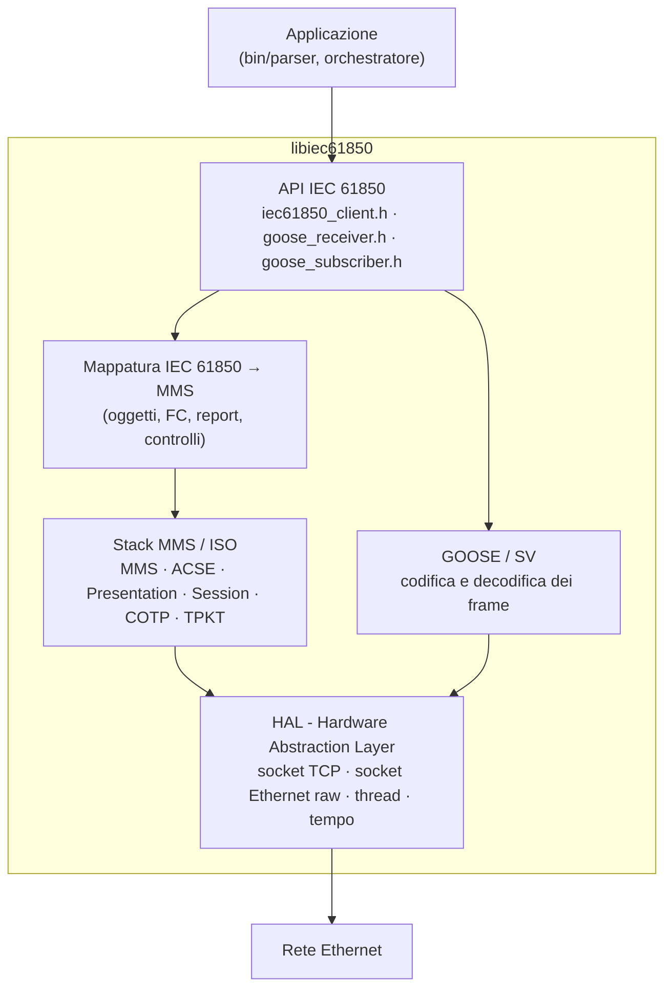
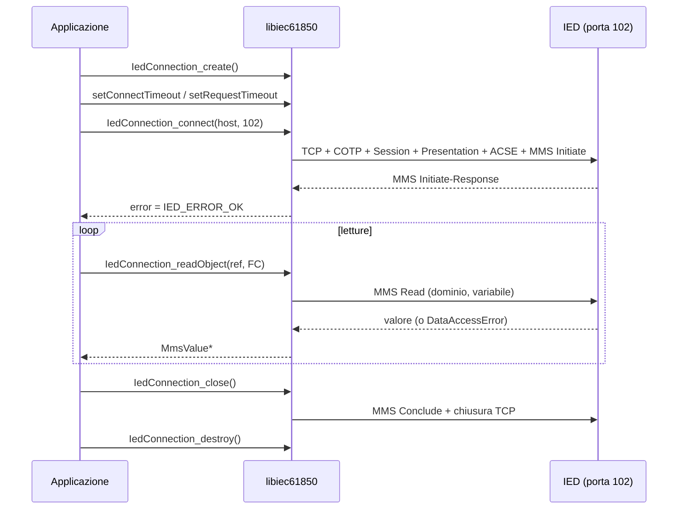
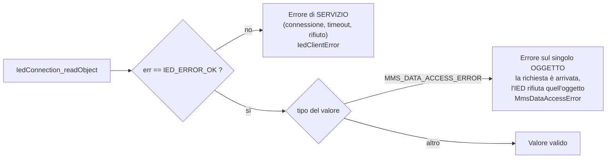
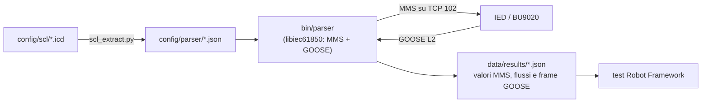

# libiec61850: funzionamento e uso nel banco di prova BU9020

Questo documento spiega come è fatta la libreria **libiec61850**, come si usano
le sue API lato *client* e come le impieghiamo nel progetto per verificare i
flussi IEC 61850 della BU9020.

Tutto quanto è riportato è stato verificato sul codice della versione
installata nel banco:

| | |
|---|---|
| Versione | **1.6.2**, ramo `v1.6_develop` (commit `bc495e97`, 25/09/2026) |
| Sorgenti | `~/libiec61850` |
| Installazione | `~/libiec61850/.install/{include,lib}` (header + `libiec61850.a`), collegata al progetto da `lib/libiec61850` |
| Licenza | **GPLv3** (doppia licenza: versione commerciale da MZ Automation GmbH) |

> **Nota sulla licenza.** L'uso per la tesi e per un banco di prova interno è
> compatibile con la GPLv3. Se il software sviluppato dovesse essere
> distribuito come prodotto aziendale, la GPLv3 imporrebbe di rilasciarne i
> sorgenti: in quel caso serve la licenza commerciale di MZ Automation.
> Va segnalato al tutor.

---

## 1. Cos'è libiec61850

libiec61850 è un'implementazione open source, scritta in C99, dei protocolli
di comunicazione dello standard IEC 61850:

- **MMS** (IEC 61850-8-1): comunicazione client/server su TCP, usata per
  leggere/scrivere dati, gestire report, comandi, file, log;
- **GOOSE** (IEC 61850-8-1): messaggi multicast a livello 2 Ethernet, per
  eventi veloci tra IED;
- **Sampled Values** (IEC 61850-9-2): flussi di campioni analogici;
- **R-GOOSE / R-SV** (IEC 61850-90-5): GOOSE e SV instradabili su IP.

Fornisce sia la parte **server** (per realizzare un IED) sia la parte
**client** (per interrogare un IED). Nel nostro progetto usiamo solo la parte
client, la parte GOOSE in ricezione e, per i test senza hardware, un server di
esempio.

---

## 2. Architettura a strati



| Strato | Ruolo | Cartella sorgenti |
|---|---|---|
| **API IEC 61850** | funzioni usate dall'applicazione (`IedConnection_*`, `GooseSubscriber_*`, …) | `src/iec61850`, `src/goose` |
| **Mappatura su MMS** | traduce oggetti IEC 61850 (LD, LN, DO, DA, FC) in variabili MMS | `src/iec61850/common`, `src/iec61850/client` |
| **Stack MMS/ISO** | protocollo MMS e strati OSI sottostanti, su TCP porta **102** | `src/mms` |
| **GOOSE/SV** | frame Ethernet con EtherType `0x88B8` (GOOSE) e `0x88BA` (SV), senza IP | `src/goose`, `src/sampled_values` |
| **HAL** | unica parte dipendente dal sistema operativo | `hal/` |

Due conseguenze pratiche:

- **MMS** passa per TCP/IP: serve solo l'indirizzo IP dell'IED e la porta 102.
- **GOOSE** non usa IP: viaggia a livello 2 su indirizzi MAC multicast
  (`01-0C-CD-01-xx-xx`), spesso con tag VLAN. Per riceverlo la libreria apre un
  socket *raw* sull'interfaccia di rete (`socket(AF_PACKET, SOCK_RAW, ...)` in
  `hal/ethernet/linux`), che su Linux richiede **root** o la capability
  `CAP_NET_RAW`.

---

## 3. Dal modello IEC 61850 ai nomi MMS

Questo è il punto più importante per usare correttamente la libreria: lo stesso
dato ha **nomi diversi** a seconda di dove compare.

### 3.1 Il modello dati

```
IED  XSCT1M01SMNPBMUC
 └─ Logical Device (LD)        XSCT1M01SMNPBMUCM1      = nome IED + inst "M1"
     └─ Logical Node (LN)      LBMULPHD1               = prefix "LBMU" + lnClass "LPHD" + inst "1"
         └─ Data Object (DO)   PhyHealth
             └─ Data Attribute (DA) stVal   [FC = ST]
```

Il **Functional Constraint (FC)** raggruppa gli attributi per funzione:

| FC | Significato | Esempi |
|---|---|---|
| `ST` | stato | `Pos.stVal`, `Health.stVal`, `q`, `t` |
| `MX` | misura | `TotW.mag.f`, `PhV.phsA.cVal.mag.f` |
| `SP` | setpoint / parametro | `VolSpt.setMag.f` |
| `CF` | configurazione | `ctlModel`, `sboTimeout` |
| `DC` | descrizione | `NamPlt.vendor`, `NamPlt.swRev` |
| `CO` | comando | `Oper`, `SBOw`, `Cancel` |
| `RP` / `BR` | report non bufferizzato / bufferizzato | `urcb01`, `brcb01` |
| `GO` | controllo GOOSE | `gocb` |

### 3.2 Le quattro forme dei riferimenti

| Dove | Forma | Esempio (IED di test) |
|---|---|---|
| **API client** (`readObject`, `writeObject`) | `LD/LN.DO.DA` + FC passato a parte | `XSCT1M01SMNPBMUCM1/LBMULPHD1.PhyHealth.stVal`, `IEC61850_FC_ST` |
| **Variabile MMS** (sulla rete) | dominio = `LD`, nome = `LN$FC$DO$DA` | dominio `XSCT1M01SMNPBMUCM1`, item `LBMULPHD1$ST$PhyHealth$stVal` |
| **API dei report** (`getRCBValues`) | `LD/LN.FC.nomeRCB` (FC **dentro** il riferimento) | `XSCT1M01SMNPBMUCM1/LLN0.RP.op_urcb01` |
| **GOOSE** (nei frame) | `LD/LN$GO$nome`, dataset `LD/LN$nome` | `XSCT1M01SMNPBMUCM1/LLN0$GO$GseBCU_Op_gocb` |

La conversione dalla prima alla seconda forma è fatta dalla libreria in
`src/iec61850/common/iec61850_common.c`
(`MmsMapping_getMmsDomainFromObjectReference` e
`MmsMapping_createMmsVariableNameFromObjectReference`): il nome del LD diventa
il *dominio* MMS, mentre il resto diventa il nome della variabile con i `.`
sostituiti da `$` e l'FC inserito dopo il nome del LN.

> **Attenzione alla differenza fra le API.** `IedConnection_readObject` vuole
> il riferimento **senza** FC (`LLN0.op_urcb01.RptEna` + `IEC61850_FC_RP`);
> `IedConnection_getRCBValues` vuole il riferimento **con** l'FC
> (`LLN0.RP.op_urcb01`), perché si limita a sostituire `.` con `$`
> (`client_report_control.c`). Per questo `bin/parser` rimuove il segmento
> `.RP.`/`.BR.` prima della `readObject`.

### 3.3 Limiti di lunghezza

Verificati nel codice della mappatura:

| Elemento | Limite |
|---|---|
| Nome del Logical Device (dominio MMS) | 64 caratteri |
| Nome della variabile MMS (`LN$FC$DO$DA`) | 64 caratteri |
| Riferimento completo all'oggetto | 129 caratteri |

Se un riferimento supera il limite la funzione non lo converte e la lettura
fallisce con `IED_ERROR_OBJECT_REFERENCE_INVALID` (12): con nomi di LN
personalizzati lunghi (es. `LDFR_SLOWRDRE1`) conviene tenerlo presente.

---

## 4. Il client MMS

### 4.1 Ciclo di vita di una connessione



Codice minimo, con i prototipi reali della versione installata:

```c
#include "iec61850_client.h"

IedClientError err;
IedConnection con = IedConnection_create();

IedConnection_setConnectTimeout(con, 5000);   /* ms */
IedConnection_setRequestTimeout(con, 2000);   /* ms, per ogni richiesta */

IedConnection_connect(con, &err, "10.145.100.26", 102);
if (err != IED_ERROR_OK) {
    /* es. 5 = IED_ERROR_CONNECTION_REJECTED: IED spento o irraggiungibile */
    IedConnection_destroy(con);
    return 1;
}

MmsValue* v = IedConnection_readObject(con, &err,
        "XSCT1M01SMNPBMUCM1/LBMULPHD1.PhyHealth.stVal", IEC61850_FC_ST);
if (v != NULL && err == IED_ERROR_OK) {
    if (MmsValue_getType(v) == MMS_INTEGER)
        printf("PhyHealth = %d\n", MmsValue_toInt32(v));
    MmsValue_delete(v);            /* il valore e' allocato dalla libreria */
}

IedConnection_close(con);
IedConnection_destroy(con);
```

Compilazione (è ciò che fa il `Makefile` del progetto):

```sh
gcc programma.c -Ilib/libiec61850/include -Llib/libiec61850/lib -liec61850 -lpthread
```

### 4.2 Thread e chiamate bloccanti

- Le funzioni come `IedConnection_readObject` sono **sincrone**: bloccano fino
  alla risposta o fino al *request timeout*.
- Internamente, `IedConnection_connect` avvia un **thread** che gestisce la
  ricezione dei messaggi (`connectionHandlingThread` in
  `mms_client_connection.c`); da quel thread arrivano anche i report e la
  notifica di connessione chiusa
  (`IedConnection_installConnectionClosedHandler`). Le callback devono quindi
  essere brevi e thread-safe.
- Esistono varianti **asincrone** (`IedConnection_readObjectAsync`, …) che
  ritornano subito e chiamano una callback alla risposta: utili per inviare
  molte richieste in parallelo e ridurre i tempi.

### 4.3 Valori: `MmsValue` e tipi

Ogni lettura restituisce un `MmsValue*`, un contenitore generico. Il tipo si
legge con `MmsValue_getType()` e il valore con la funzione corrispondente:

| Tipo MMS | Tipi IEC 61850 tipici | Funzione | Note |
|---|---|---|---|
| `MMS_BOOLEAN` | `BOOLEAN` (SPS.stVal, ACT.general) | `MmsValue_getBoolean` | |
| `MMS_INTEGER` | `INT8..INT64`, **enumerati** (Mod, Beh, Health) | `MmsValue_toInt32` / `toInt64` | gli enum arrivano come interi |
| `MMS_UNSIGNED` | `INT8U..INT32U` | `MmsValue_toUint32` | |
| `MMS_FLOAT` | `FLOAT32/64` (mag.f) | `MmsValue_toFloat` / `toDouble` | |
| `MMS_BIT_STRING` | **Dbpos** (2 bit), **Quality** (13 bit) | `MmsValue_getBitStringAsIntegerBigEndian`, `Dbpos_fromMmsValue` | Dbpos: 0 intermedio, 1 off, 2 on, 3 bad |
| `MMS_UTC_TIME` | `Timestamp` (t) | `MmsValue_getUtcTimeInMs` | ms da epoch |
| `MMS_VISIBLE_STRING` | `VisString` (NamPlt.vendor) | `MmsValue_toString` | |
| `MMS_STRUCTURE` | un DO o un DA composto letto per intero | `MmsValue_getElement(v, i)` | |
| `MMS_DATA_ACCESS_ERROR` | — | `MmsValue_getDataAccessError` | vedi §5 |

Regole di gestione della memoria:

- il chiamante è **proprietario** del valore restituito e deve liberarlo con
  `MmsValue_delete()`;
- gli elementi ottenuti con `MmsValue_getElement()` appartengono alla
  struttura e **non** vanno liberati singolarmente.

Leggere un DO intero (es. `LLN0.Health` con FC `ST`) restituisce una
`MMS_STRUCTURE` con `stVal`, `q`, `t` in un'unica richiesta: è più efficiente
di tre letture separate.

### 4.4 Esplorare il modello direttamente dall'IED

Oltre al file SCL, il modello si può chiedere all'IED stesso:

| Funzione | Restituisce |
|---|---|
| `IedConnection_getServerDirectory(con, &err, false)` | elenco dei Logical Device |
| `IedConnection_getLogicalDeviceDirectory(con, &err, "LD")` | elenco dei LN di un LD |
| `IedConnection_getLogicalNodeDirectory(con, &err, "LD/LN", ACSI_CLASS_DATA_OBJECT)` | DO (o dataset, RCB, … secondo la classe ACSI) |
| `IedConnection_getDataDirectoryFC(con, &err, "LD/LN.DO")` | attributi del DO con il loro FC |
| `IedConnection_getVariableSpecification(...)` | tipo MMS di un attributo |

Confrontare il modello letto dall'IED con quello del file ICD è una verifica
utile: differenze indicano un file non allineato con la configurazione
caricata sul dispositivo.

---

## 5. Gli errori: due livelli distinti

Una lettura può fallire in due modi diversi, e la differenza è importante per
interpretare i risultati.



**`IedClientError`**: la richiesta non è andata a buon fine (valori da
`iec61850_client.h`).

| Codice | Nome | Quando capita |
|---|---|---|
| 0 | `IED_ERROR_OK` | tutto bene |
| 1 | `IED_ERROR_NOT_CONNECTED` | richiesta senza connessione attiva |
| 3 | `IED_ERROR_CONNECTION_LOST` | connessione caduta durante l'uso |
| **5** | `IED_ERROR_CONNECTION_REJECTED` | **IED spento o irraggiungibile** (osservato il 06/10/2026 durante la riconfigurazione) |
| 12 | `IED_ERROR_OBJECT_REFERENCE_INVALID` | riferimento malformato o troppo lungo |
| 20 | `IED_ERROR_TIMEOUT` | nessuna risposta entro il request timeout |
| 21 | `IED_ERROR_ACCESS_DENIED` | accesso negato al servizio |
| 22 | `IED_ERROR_OBJECT_DOES_NOT_EXIST` | oggetto inesistente (servizi diversi dalla lettura) |

**`MmsDataAccessError`**: la richiesta è arrivata, ma per quell'oggetto l'IED
restituisce un errore invece del valore (valori da `mms_value.h`). In questo
caso `err` vale `IED_ERROR_OK`: va controllato il **tipo** del valore.

| Codice | Nome | Significato |
|---|---|---|
| 2 | `TEMPORARILY_UNAVAILABLE` | dato momentaneamente non disponibile |
| **3** | `OBJECT_ACCESS_DENIED` | l'IED nega la lettura di quell'oggetto (osservato su `LBMULTMS1.TmSrc.stVal`) |
| 7 | `TYPE_INCONSISTENT` | FC o tipo non coerenti con l'oggetto |
| **10** | `OBJECT_NONE_EXISTENT` | **l'oggetto non esiste** (osservato con i riferimenti `BU9020/...` sull'IED di test) |

---

## 6. Report (RCB)

Il polling (letture ripetute) non dice *quando* un valore è cambiato con
precisione maggiore dell'intervallo di lettura. I **report** risolvono il
problema: è l'IED a inviare al client i valori di un dataset quando cambiano,
con un timestamp generato dall'IED.

Concetti:

- un **Report Control Block** (RCB) è associato a un dataset; può essere
  *unbuffered* (`RP`, i report persi a connessione chiusa sono persi) o
  *buffered* (`BR`, l'IED conserva i report e li reinvia);
- ogni RCB esiste in più **istanze** (es. `op_urcb01`…`op_urcb04`), una per
  client: se `indexed` è vero (default) il nome ha il suffisso numerico;
- i campi principali: `RptEna` (abilitazione), `TrgOps` (cosa genera un report:
  cambio dato, cambio qualità, aggiornamento, integrità periodica, GI),
  `IntgPd` (periodo di integrità), `GI` (General Interrogation: invia subito
  tutti i valori).

Sequenza d'uso (come nell'esempio ufficiale
`examples/iec61850_client_example_reporting`):

```c
static void onReport(void* param, ClientReport report)
{
    MmsValue* values = ClientReport_getDataSetValues(report);
    if (ClientReport_hasTimestamp(report))
        printf("report alle %llu ms\n",
               (unsigned long long) ClientReport_getTimestamp(report));
    /* per ogni elemento: ClientReport_getReasonForInclusion(report, i) */
}

/* 1. legge i valori attuali dell'RCB (riferimento CON l'FC) */
ClientReportControlBlock rcb = IedConnection_getRCBValues(con, &err,
        "XSCT1M01SMNPBMUCM1/LLN0.RP.op_urcb01", NULL);

/* 2. registra la callback (riferimento senza indice d'istanza + rptID) */
IedConnection_installReportHandler(con, "XSCT1M01SMNPBMUCM1/LLN0.RP.op_urcb",
        ClientReportControlBlock_getRptId(rcb), onReport, NULL);

/* 3. configura e abilita */
ClientReportControlBlock_setTrgOps(rcb, TRG_OPT_DATA_CHANGED | TRG_OPT_QUALITY_CHANGED | TRG_OPT_GI);
ClientReportControlBlock_setRptEna(rcb, true);
ClientReportControlBlock_setGI(rcb, true);
IedConnection_setRCBValues(con, &err, rcb,
        RCB_ELEMENT_TRG_OPS | RCB_ELEMENT_RPT_ENA | RCB_ELEMENT_GI, true);

/* ... i report arrivano nella callback, sul thread della connessione ... */

/* 4. disabilita prima di chiudere */
ClientReportControlBlock_setRptEna(rcb, false);
IedConnection_setRCBValues(con, &err, rcb, RCB_ELEMENT_RPT_ENA, true);
ClientReportControlBlock_destroy(rcb);
```

Il terzo argomento di `setRCBValues` è una **maschera** che dice quali campi
scrivere (`RCB_ELEMENT_RPT_ENA` = 2, `RCB_ELEMENT_TRG_OPS` = 256,
`RCB_ELEMENT_GI` = 1024, …): si scrivono solo i campi indicati.

Nell'IED di test i tre RCB (`Anom_Aliment_BMUOP_urcb`, `Anom_IED_BMUOP_urcb`,
`op_urcb`) esistono e risultano `RptEna = false`: nessun client li sta usando.

---

## 7. Comandi (FC `CO`)

I comandi (aprire un interruttore, avviare una registrazione, …) si inviano con
`ControlObjectClient`. Il comportamento dipende dal **modello di controllo**
(`ctlModel`, FC `CF`) definito per quel DO:

| ctlModel | Sequenza |
|---|---|
| `status-only` | non comandabile |
| `direct-with-normal-security` | `operate` |
| `sbo-with-normal-security` | `select` → `operate` |
| `direct-with-enhanced-security` | `operate` + attesa della *CommandTermination* |
| `sbo-with-enhanced-security` | `selectWithValue` → `operate` + *CommandTermination* (es. `LDFRRDRE1.RcdTrg` nell'IED di test) |

```c
ControlObjectClient ctl = ControlObjectClient_create("LD/LN.DO", con);
ControlObjectClient_setOrigin(ctl, "banco-test", CONTROL_ORCAT_STATION_CONTROL);
MmsValue* val = MmsValue_newBoolean(true);
if (ControlObjectClient_selectWithValue(ctl, val))       /* solo per SBO */
    ControlObjectClient_operate(ctl, val, 0);             /* 0 = esegui subito */
MmsValue_delete(val);
ControlObjectClient_destroy(ctl);
```

> **Attenzione.** Un comando agisce sull'impianto reale (o sul banco).
> Usare i comandi solo con l'autorizzazione del tutor e solo su oggetti
> previsti dagli scenari. I flag `ControlObjectClient_setInterlockCheck` e
> `ControlObjectClient_setSynchroCheck` chiedono all'IED di verificare
> interblocchi e sincronismo prima di eseguire: per lo scenario di
> sincronismo sono proprio l'oggetto della verifica.

---

## 8. GOOSE

### 8.1 Come funziona

Un GOOSE è un frame Ethernet multicast che l'IED pubblica:

- a **ogni cambio** di un valore del dataset: `stNum` aumenta di 1, `sqNum`
  riparte, il frame viene ripetuto a intervalli crescenti (da `MinTime`, es.
  3 ms nell'IED di test);
- **periodicamente** quando non cambia nulla (heartbeat, `MaxTime`, 2000 ms
  nell'IED di test), con `sqNum` crescente.

Ogni frame dichiara un **timeAllowedToLive** (TTL, 4000 ms nell'IED di test):
se il ricevitore non vede il frame successivo entro il TTL, considera il
flusso perso.

### 8.2 Ricezione con la libreria

```c
#include "goose_receiver.h"
#include "goose_subscriber.h"

static void onGoose(GooseSubscriber sub, void* param)
{
    printf("stNum=%u sqNum=%u TTL=%u ms valido=%d\n",
           GooseSubscriber_getStNum(sub), GooseSubscriber_getSqNum(sub),
           GooseSubscriber_getTimeAllowedToLive(sub), GooseSubscriber_isValid(sub));
    /* NON liberare e usare solo dentro la callback: la libreria riusa
       questo valore al frame successivo (nota in goose_subscriber.h) */
    MmsValue* values = GooseSubscriber_getDataSetValues(sub);
}

GooseReceiver rx = GooseReceiver_create();
GooseReceiver_setInterfaceId(rx, "enx503f56005b3e");          /* interfaccia del banco */

GooseSubscriber sub = GooseSubscriber_create(
        "XSCT1M01SMNPBMUCM1/LLN0$GO$GseBCU_Op_gocb", NULL);   /* gocbRef */
GooseSubscriber_setAppId(sub, 0x0E65);                        /* APPID dall'SCL */
GooseSubscriber_setListener(sub, onGoose, NULL);

GooseReceiver_addSubscriber(rx, sub);
GooseReceiver_start(rx);          /* avvia un thread di ricezione */
/* ... */
GooseReceiver_stop(rx);
GooseReceiver_destroy(rx);        /* distrugge anche i subscriber aggiunti */
```

Il programma va eseguito con `sudo` (o con `setcap cap_net_raw+ep`) per via
del socket raw.

### 8.3 libiec61850 o tshark?

Nel progetto i GOOSE vengono ricevuti in tempo reale con libiec61850 da
`bin/parser`, insieme alle letture MMS; tshark/Wireshark resta lo strumento
per l'analisi manuale. Le due strade a confronto:

| | Ricezione con libiec61850 (`bin/parser`) | Cattura tshark + Wireshark |
|---|---|---|
| Momento | in tempo reale, insieme alle letture MMS | a posteriori, su file `.pcapng` |
| Risultato | JSON pronto per i test automatici (Robot) | file da ispezionare a mano |
| Vede | tutti i GOOSE (modo observer) | tutto il traffico di rete |
| Istante di ricezione | preso nel programma (meno preciso) | preso dal kernel (più preciso) |

---

## 9. Come la usiamo nel progetto



### 9.1 Funzioni usate da `bin/parser`

| Funzione | Uso nel programma |
|---|---|
| `IedConnection_create` / `connect` | connessione all'IED, con misura della latenza di connessione |
| `IedConnection_readObject` | lettura di ogni punto della configurazione |
| `MmsValue_getType` e conversioni | traduzione nel JSON di output (§4.3) |
| `Dbpos_fromMmsValue` | posizione degli interruttori (`Pos.stVal`) |
| `MmsValue_getDataAccessError` | errori per singolo oggetto (§5) |
| `readObject` su `<RCB>.RptEna` con FC `RP`/`BR` | verifica presenza e stato dei report block |
| `IedConnection_close` / `destroy` | chiusura |
| `GooseReceiver_*`, `GooseSubscriber_*` (§8.2) | ricezione GOOSE in tempo reale durante le letture MMS |
| `GooseSubscriber_setObserver` | ricezione di tutti i GOOSE quando la configurazione non elenca GoCB |

### 9.2 Strumenti della libreria utili per la diagnosi

Compilati in `~/libiec61850/build/examples/`:

```sh
# identità del server MMS (fornitore, modello, versione dello stack)
mms_utility/mms_utility -h 10.145.100.26 -i
#   -> Tamarack Consulting, Inc  MMSd  8.8   (sull'IED di test)

# elenco dei domini (Logical Device)
mms_utility/mms_utility -h 10.145.100.26 -d

# lettura di una variabile MMS: -a dominio, -r nome MMS (con $ e FC)
mms_utility/mms_utility -h 10.145.100.26 -a XSCT1M01SMNPBMUCM1 -r 'LLN0$ST$Health$stVal'

# server di prova in locale, per provare i client senza IED (porta a scelta)
server_example_basic_io/server_example_basic_io 10102
```

`mms_utility` è stato usato per verificare in modo indipendente dal nostro
codice i valori letti dal client MMS (stessi risultati), e
`server_example_basic_io` per collaudare il client e il parser senza hardware.

### 9.3 Ricompilare la libreria

```sh
cd ~/libiec61850
make                 # compila con il Makefile della libreria
sudo make install    # copia header e libreria statica in .install/
```

Con CMake si possono abilitare/disabilitare funzioni (es.
`-DCONFIG_INCLUDE_GOOSE_SUPPORT=ON`, `-DBUILD_EXAMPLES=ON`). Sulla SBC ARM la
procedura è la stessa: la libreria non ha dipendenze obbligatorie esterne.

---

## 10. Prossimi utilizzi nel progetto

1. **Report invece di letture singole** (§6): abilitare un RCB del dataset
   dello scenario e registrare l'istante di ogni report, così da misurare
   quando la BU9020 aggiorna lo stato dopo lo stimolo dell'ESP32.
2. **Letture asincrone o di DO interi** (§4.2, §4.3) per ridurre il tempo
   totale delle letture (oggi ~650 ms per 29 punti, una richiesta per punto).
3. **Confronto modello IED / file ICD** con le funzioni di §4.4, da includere
   nella verifica iniziale di ogni nuova configurazione.
4. **Subscriber GOOSE** (§8): già integrato in `bin/parser` (vedi
   `docs/parser.md`); resta da usarlo
   nell'orchestratore per reagire in tempo reale agli eventi.

---

## 11. Problemi comuni

| Sintomo | Causa probabile | Verifica |
|---|---|---|
| `connessione fallita (err=5)` | IED spento, IP errato, cavo/VLAN | `ping`, `mms_utility -i` |
| `access_error 10` su tutti i punti | nome del LD sbagliato (es. `BU9020/` invece di `XSCT1M01SMNPBMUCM1/`) | `mms_utility -d`, file SCL |
| `access_error 10` su un punto | DO/DA o FC errati | `scl_extract.py`, `getDataDirectoryFC` |
| `access_error 3` | lettura negata dall'IED per quell'oggetto | escludere il punto o chiedere al tutor |
| valori `0` / stringhe vuote | modello non popolato dall'applicazione dell'IED | `mms_utility` (stesso risultato = non è il client) |
| `RptEna: null` | riferimento RCB senza indice di istanza (`op_urcb` invece di `op_urcb01`) | `report_inventario.csv` |
| errore 12 su un riferimento | riferimento troppo lungo (> 64 caratteri come nome MMS) | §3.3 |
| nessun GOOSE ricevuto dal subscriber | manca root/`CAP_NET_RAW`, interfaccia o APPID errati | `sudo`, `tshark -i <if> -Y goose` |

---

## Riferimenti

- Sorgenti e header: `~/libiec61850/src`, `~/libiec61850/.install/include`
  (`iec61850_client.h`, `mms_value.h`, `goose_receiver.h`, `goose_subscriber.h`)
- Esempi ufficiali: `~/libiec61850/examples` (in particolare
  `iec61850_client_example1`, `iec61850_client_example_reporting`,
  `iec61850_client_example_control`, `goose_subscriber`)
- Documentazione API: `~/libiec61850/src/doxygen` (generabile con Doxygen)
- Sito del progetto: <https://libiec61850.com>
- Standard: IEC 61850-7-2 (servizi ACSI), IEC 61850-7-3 (classi di dati
  comuni), IEC 61850-8-1 (mappatura su MMS e GOOSE)
