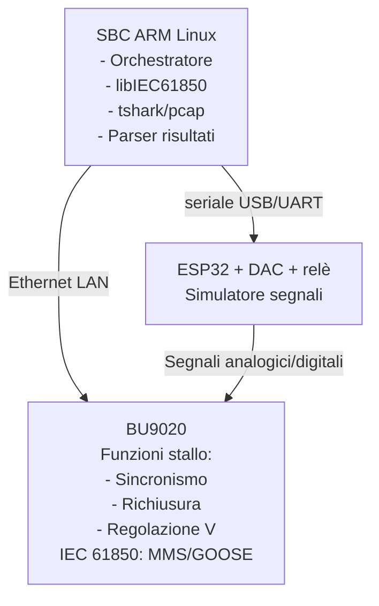
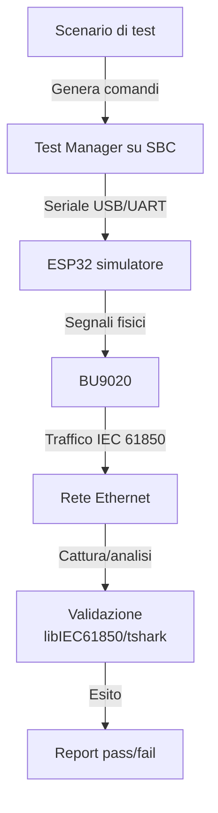

# Proposta di argomento tesi

**Azienda:** COL Group

## Titolo provvisorio

**Studio e verifica dei flussi IEC 61850 per unità BU9020 mediante test bench Linux, libIEC61850 e analisi Wireshark**

---

## Contesto

La BU9020 è una unità destinata ad applicazioni di stallo in ambito elettrico. Fornisce funzioni di controllo e monitoraggio quali:

- controllo di sincronismo;
- richiusura automatica;
- regolazione della tensione del trasformatore;
- gestione di ingressi e uscite digitali;
- pubblicazione e ricezione di messaggi IEC 61850.

La piattaforma di prova prevede un sistema (già realizzato dall'azienda) basato su microcontrollore **ESP32**, DAC e relè, capace di generare segnali analogici trifase e stati digitali controllati. Tale piattaforma può essere pilotata via interfaccia UART.

La tesi si concentra quindi sulla parte software di gestione del banco e sullo studio dei flussi IEC 61850, usando un SBC ARM Linux come orchestratore, un client basato su **libIEC61850** e Wireshark/tshark per il check dei frame di rete.

---

## Obiettivo della tesi

L'obiettivo è progettare e realizzare un ambiente di test per gestire la scheda di segnali analogici/digitali e analizzare i flussi IEC 61850 generati o ricevuti dalla BU9020 durante scenari funzionali controllati.

Il lavoro dovrà correlare tre livelli:

1. **Stimolo fisico simulato** – Comandi inviati via seriale alla piattaforma ESP32 per generare condizioni analogiche e digitali.
2. **Comportamento applicativo della BU9020** – Attivazione di funzioni come sincronismo, richiusura o regolazione tensione.
3. **Traffico IEC 61850 sulla LAN** – Messaggi MMS/GOOSE osservati tramite client libIEC61850 e cattura Wireshark.

Il risultato atteso non è solo una cattura passiva del traffico, ma una procedura ripetibile capace di dire se un determinato scenario produce il flusso IEC 61850 atteso.

---

## Architettura proposta



---

## Componenti software della tesi

### 1. Orchestratore dei test

Un programma o insieme di script, preferibilmente in Python, con il compito di:

- caricare una descrizione dello scenario di test;
- inviare comandi seriali alla piattaforma ESP32;
- avviare la cattura del traffico di rete;
- interrogare la BU9020 tramite client IEC 61850;
- raccogliere risultati e log;
- generare un report di esito.

### 2. Client IEC 61850 basato su libreria open source libIEC61850

Il client dovrà permettere almeno:

- connessione MMS alla BU9020;
- lettura di oggetti dati;
- verifica di attributi IEC 61850;
- eventuale attivazione o controllo di Report Control Block;
- sottoscrizione o analisi GOOSE se supportata nel setup;
- correlazione dei valori letti con gli eventi generati.

Esempi di verifiche:

```text
Evento simulato:
  perdita sincronismo tra tensione linea e sbarra

Atteso:
  aggiornamento stato logico interno
  eventuale blocco del comando
  pubblicazione GOOSE con stato non sincronizzato
  valori coerenti leggibili via MMS
```

La parte interessante della tesi è trasformare il client da semplice tool di lettura a componente di verifica automatica.

### 3. Acquisizione e validazione con Wireshark/tshark

Wireshark rimane lo strumento di riferimento per la validazione manuale e diagnostica, ma la tesi può usare anche **tshark** per estrarre automaticamente campi dai file `.pcapng`.

Le verifiche possono riguardare:

- presenza dei frame GOOSE attesi;
- correttezza di:
  - `gocbRef`;
  - `datSet`;
  - `goID`;
  - `stNum`;
  - `sqNum`;
  - `timeAllowedToLive`;
  - timestamp;
  - payload applicativo;
- sequenza dei messaggi dopo un evento;
- coerenza tra cambio di stato e incremento di `stNum`;
- ritrasmissioni GOOSE dopo cambio stato;
- latenza evento → frame GOOSE;
- assenza di frame inattesi.

Esempio di comando utile:

```sh
tshark -r test_sync_check_ok.pcapng \
  -Y "goose" \
  -T fields \
  -e frame.time_epoch \
  -e eth.src \
  -e goose.gocbRef \
  -e goose.datSet \
  -e goose.goID \
  -e goose.stNum \
  -e goose.sqNum
```

### 4. *(Opzionale)* Server web per il controllo del simulatore

> **Nota:** Questa componente rappresenta un obiettivo secondario della tesi, non il focus principale. La concentrazione primaria rimane sulla gestione del banco segnali e sullo studio/check dei flussi IEC 61850. Lo sviluppo del webserver è consigliato solo se il tempo lo permette, come supporto alla usabilità e integrazione del sistema.

L'orchestratore dei test espone un'interfaccia web (HTTP/REST) su un server in esecuzione sull'SBC ARM Linux. Il webserver funge da **unità di controllo e interfaccia grafica** per pilotare il simulatore, ma **non comunica direttamente** con l'ESP32: tutti i comandi vengono instradati attraverso l'orchestratore, che li trasmette via seriale al simulatore.

Funzionalità dell'interfaccia web:

- **Controllo remoto del simulatore** – Invio di comandi al simulatore di segnali tramite l'orchestratore, con interfaccia HTTP/REST semplificata.
- **Dashboard di monitoraggio in tempo reale** – Visualizzazione dello stato corrente dei segnali analogici, degli ingressi/uscite digitali e della connessione con la BU9020.
- **Gestione degli scenari di test** – Interfaccia per caricare, modificare, eseguire e visualizzare i risultati degli scenari di test definiti in YAML o JSON.
- **API REST per l'automazione** – Endpoint per:
  - avviare/fermare test specifici;
  - leggere lo stato corrente dei segnali;
  - impostare valori di tensione, fase, stati digitali;
  - recuperare log e report di analisi;
  - accedere ai file pcap acquisiti.

Architettura di comunicazione:

```text
Webserver (GUI/REST) → Orchestratore → Seriale USB/UART → ESP32 Simulatore
```

Esempio di endpoint:

| Metodo | Endpoint | Descrizione |
|---|---|---|
| `GET`  | `/api/simulator/status` | stato corrente segnali |
| `POST` | `/api/simulator/command` | invia comando al simulatore |
| `GET`  | `/api/test/scenarios` | lista scenari disponibili |
| `POST` | `/api/test/run` | avvia esecuzione test |
| `GET`  | `/api/test/results/{test_id}` | risultati test completato |
| `GET`  | `/api/capture/{test_id}/download` | scarica file pcap |

Vantaggi dell'approccio:

- **Separazione di concernimenti:** il simulatore ESP32 riceve comandi via seriale, il server web coordina e presenta risultati.
- **Riproducibilità:** ogni test è tracciato con timestamp, file di cattura e log strutturato.
- **Debugging facilitato:** accesso ai dati di test da remoto, visualizzazione di grafici temporali di segnali e messaggi IEC 61850.
- **Integrazione con sistemi di CI/CD:** i test possono essere avviati automaticamente da pipeline esterne via API REST.

---

## Scenari di test

### 1. Validazione controllo di sincronismo

**Scopo:** verificare che la BU9020 generi stati e messaggi coerenti quando le grandezze simulate sono compatibili o incompatibili con la chiusura.

Variabili controllate:

- differenza di fase;
- differenza di tensione;
- differenza di frequenza, se supportata dalla piattaforma;
- stato digitale di abilitazione comando.

Verifiche IEC 61850:

- stato consenso sincronismo;
- eventuale pubblicazione GOOSE;
- lettura MMS dello stato associato;
- latenza tra stimolo e aggiornamento.

### 2. Validazione richiusura automatica

**Scopo:** verificare la sequenza logica associata alla richiusura.

Variabili controllate:

- apertura interruttore;
- simulazione guasto;
- rientro condizioni corrette;
- abilitazione/inibizione richiusura.

Verifiche IEC 61850:

- sequenza degli stati;
- comandi/feedback associati;
- messaggi GOOSE generati;
- incremento corretto di `stNum`;
- timing tra eventi.

### 3. Validazione regolazione tensione trasformatore

**Scopo:** simulare condizioni di sottotensione o sovratensione e verificare i flussi associati alla regolazione.

Variabili controllate:

- tensione misurata;
- soglie di regolazione;
- ingressi digitali di blocco o consenso;
- eventuali feedback di posizione.

Verifiche IEC 61850:

- stato regolatore;
- richieste di salita/discesa tap;
- messaggi GOOSE relativi;
- valori MMS esposti dalla BU9020;
- coerenza tra scenario e comando atteso.

---

## Elaborati della tesi

La tesi può produrre:

1. **Ambiente Linux di test**
   - configurazione SBC;
   - script di pianificazione;
   - gestione seriale verso ESP32;
   - gestione cattura rete.
2. **Client IEC 61850** [C]
   - basato su libIEC61850;
   - capace di leggere dati MMS;
   - eventualmente capace di sottoscrivere GOOSE;
   - integrato nel flusso automatico di test.
3. **Suite di test** [Python]
   - scenari descritti in YAML/JSON;
   - stimoli;
   - condizioni attese;
   - criteri di pass/fail.
4. **Analizzatore dei pacchetti** [Wireshark e tool derivati]
   - uso di tshark/pcap;
   - estrazione campi IEC 61850;
   - verifica automatica dei frame GOOSE;
   - generazione report.
5. **Report finale**
   - esito dei test;
   - tempi misurati;
   - messaggi osservati;
   - eventuali anomalie.

---

## Struttura possibile della tesi

### Capitolo 1 — Introduzione

- automazione di sottostazione;
- ruolo degli IED;
- motivazione della validazione dei flussi IEC 61850;
- descrizione sintetica BU9020;
- obiettivi del lavoro.

### Capitolo 2 — IEC 61850 e comunicazione tra IED

- modello dati IEC 61850;
- MMS;
- GOOSE;
- concetto di dataset;
- concetto di Logical Node;
- ruolo dei file ICD/CID/SCD;
- differenza tra validazione funzionale e validazione protocollare.

### Capitolo 3 — Architettura del banco di prova

- BU9020;
- SBC ARM Linux;
- piattaforma simulazione segnali fornita da azienda (ESP32 + DAC + relè);
- collegamento seriale;
- rete Ethernet condivisa;
- strumenti software usati.

### Capitolo 4 — Implementazione del sistema di test

- orchestratore;
- protocollo seriale verso ESP32;
- integrazione libIEC61850;
- cattura con Wireshark/tshark;
- formato degli scenari;
- gestione risultati.

### Capitolo 5 — Validazione sperimentale

- scenari selezionati;
- procedura di esecuzione;
- risultati;
- analisi dei frame GOOSE;
- correlazione stimolo/evento/messaggio;
- casi di errore o comportamento inatteso.

### Capitolo 6 — Conclusioni

- efficacia dell'ambiente;
- limiti;
- estensioni future;
- integrazione in pipeline di test più ampia.

---

## Contributo tecnico della tesi

Il contributo principale non è la realizzazione del simulatore di segnali, già disponibile, ma lo studio di un protocollo IEC e la costruzione di un **framework** capace di automatizzare il ciclo:



---

## Sintesi proposta tesi

La tesi propone la realizzazione di un ambiente di test per lo studio dei flussi IEC 61850 di una unità BU9020. Il sistema, eseguito su SBC ARM Linux, pilota via seriale una piattaforma ESP32 già predisposta per generare segnali analogici e digitali, interroga la BU9020 tramite libIEC61850 e analizza il traffico di rete con Wireshark/tshark. L'obiettivo è correlare gli stimoli applicati al dispositivo con i messaggi MMS/GOOSE generati, controllando struttura dei frame, sequenza degli eventi e coerenza dei flussi nei casi di sincronismo, richiusura automatica e regolazione tensione.
